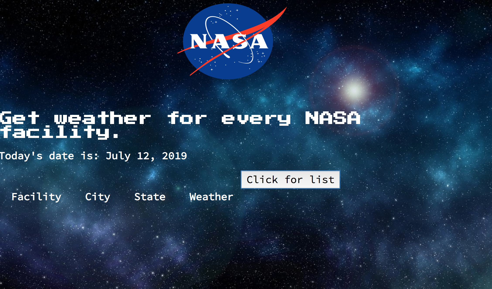

# API Complex Nasa Project
This application gets the weather for the city, state and facilities

## How it's made:
**Tech Used** I used HTML5, CSS3 and JavaScript to build this project. I also used openweather and Nasa's API's.

## Lesson Learned
I learned how to work through the difficulties of API repeated calls 
