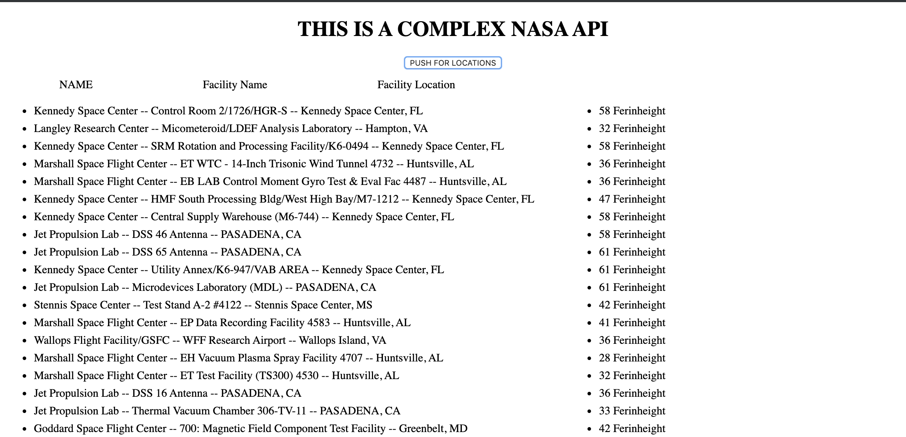

# 🚀 Project: Complex NASA API

### Goal: Use NASA's API to return all of their facility locations (~400). Display the name of the facility, its location, and the weather at the facility currently.

### In this application I used a NASA API that provides the information of all the NASA facility and location.  Then in order to get the temp. I use the coordinates of the locations in order the get there temp through a weather API.

### Click here to check out out all the NASA locations and there current temperature: https://vibrant-kirch-6bf12b.netlify.com/

Tech Used:
- HTML5
- CSS
- Javascript
