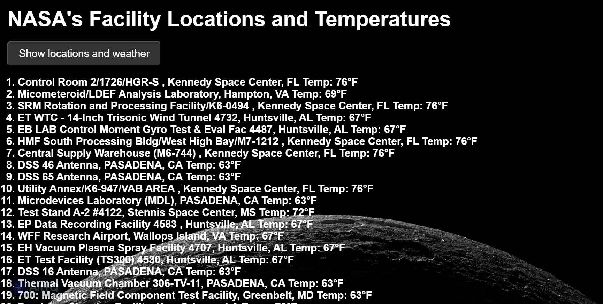

# 🚀 Mixed NASA and Weather API

Used NASA's API to return all (~400) of their facility locations. The name of the facility, its location, and the weather at the facility are displayed when the button is clicked.

Link to project: https://menahassan-nasa-weather-api.netlify.app/

# How It's Made
Tech used: HTML, CSS, JavaScript

# Lessons Learned:
Working on this project allowed me to practice using the fetch method to grab data from an API. 

Once you find a functional API, the rest of the work is fairly straightforward. You just need to map out the path to each data point you're looking to grab. This process looks slightly different for each API you're using since not all data is organized the same way but there's enough of an overlap so that you can generally get a sense of the pattern you need to follow.

I learned about destructuring assignment which is a syntax that allows you to unpack values from arrays or properties from objects into distinct variables. In simpler terms, it's a shorthand method.

