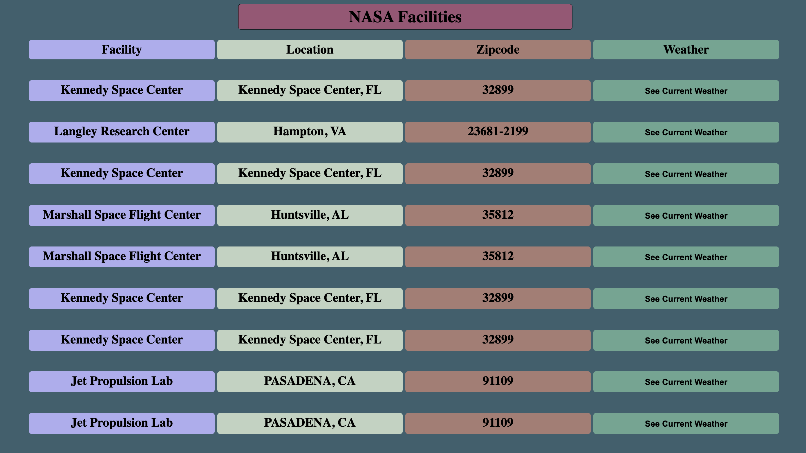

# 🚀 Project: Complex NASA API

## Link to project 

## This uses an api that displays all the NASA facilities and for each Facility we use its zipcode to get the weather with the use of a second api. 

