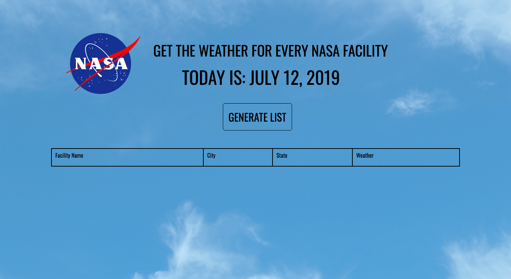

# NASA Complex Facilities + Weather API
This was my first time using two APIs at once, with one API using information from the other. It was admittedly obnoxious to do but a good learning experience.

## How It's Made:

**Tech used:** HTML, CSS, Javascript

Really just used some basic HTML & CSS along with the ES6 I used after fetching the data from NASA.

## Optimizations
There's obviously a great deal of styling to be done here, but it could also use some basic optimizations like allowing users to choose how many facilities they want to see at one time, or perhaps limit the results based on a range of locations or some other set of parameters like temperature. The main purpose of this project was to gain some familiarity with APIs however, so i likely won't tinker too much more with it.

## Lessons Learned:

I learned you have to be veeery careful when dealing with APIs that have limits on requests per day, especially if you're trying to do something like generate a list of 400+ items per fetch. I also learned how to take the output of one API and use it in another, which will absolutely be useful in the future.
