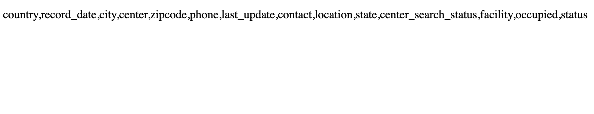

# 🎰 Week08 Bootcamp2021 Project: Complex NASA API

### Goal: Use NASA's API to return all of their facility locations (~400). Display the name of the facility, its location, and the weather at the facility currently.

This is my Complex NASA API project that allows users to fetch the name, location, and current weather of all of NASA's 400 facilities.

</img>

Link to live site: [https://danielmtran-complexnasaapi.netlify.app]

### How It's Made:

Tech used: HTML, CSS, JAVASCRIPT

I made the basic styling and layout of the app via HTML and CSS. The main functionality of the app was made using Javascript.

### Optimizations:

### Lessons Learned:

This project forced me to combined methodologies that I learned in both my  previous Simple Weather + NASA API projects.