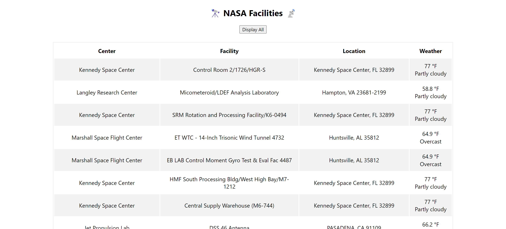

# NASA Facilities & Weather App

### Description
This app fetches and displays information about all NASA facilities, including the center, facility name, location (city, state, zipcode) and current weather conditions.
- NASA facilities data is obtained from <a href="https://api.nasa.gov/">NASA APIs</a>.
- Weather data is obtained from <a href="https://www.weatherapi.com/">WeatherAPI</a>.

Check out the app <a href="https://xsarahyu.github.io/NASA-facilities-weather-app/">here</a>!

### Tech Used
- HTML
- CSS
- JavaScript

### Lessons Learned
- How to display and append data using tables in HTML.
- Using HTTPS for API requests helps ensure security, compliance with Same-Origin Policy, and integrity of the data being transmitted between the web page and external server.