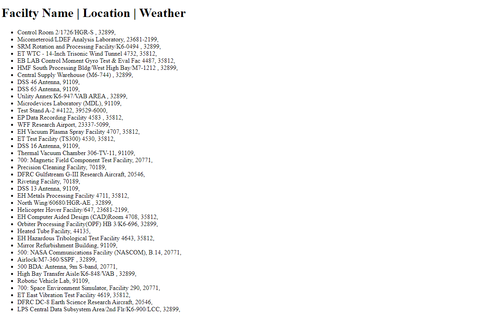

# 🚀 Project: Complex NASA API

### Goal: Use NASA's API to return all of their facility locations (~400). Display the name of the facility, its location, and the weather at the facility currently. 

This project is a complex Nasa Project utilizing 2 different api's one for the location of the facility & the current weather in fahrenheit.
I used a list items to list them in top to bottom order & concatenation to list the information

### How to submit your code for review:

### How it's Made
Tech used: HTML, CSS, Javascript

### Optimizations
I would go back & make this into a table with Javascript for a more organized look
the single string is good but isn't need whilst a table can have many more categories

### Lessons Learned
I learned alot connecting information together in this project from 2 different API's & displaying it.

## Example

