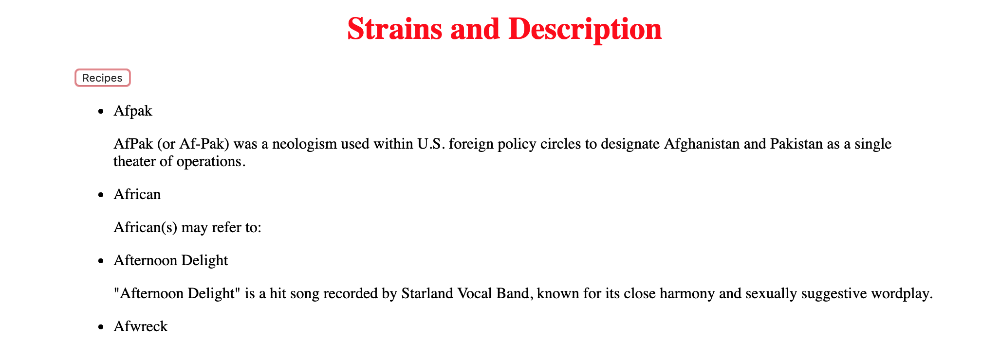

# My NASA Complex Project

In this project is suppose to pull the NASA API and a weather API to show the weather at all NASA facilities.

## How It's Made:

**Tech used:** HTML, CSS, JavaScript, Framework of choice
 
 In this project I used js and fetching APIs to get to display the location of all NASA facilities and the weather at those locations.

## Lessons Learned:

In this project I had trouble figuring out how to pull the data I wanted.

