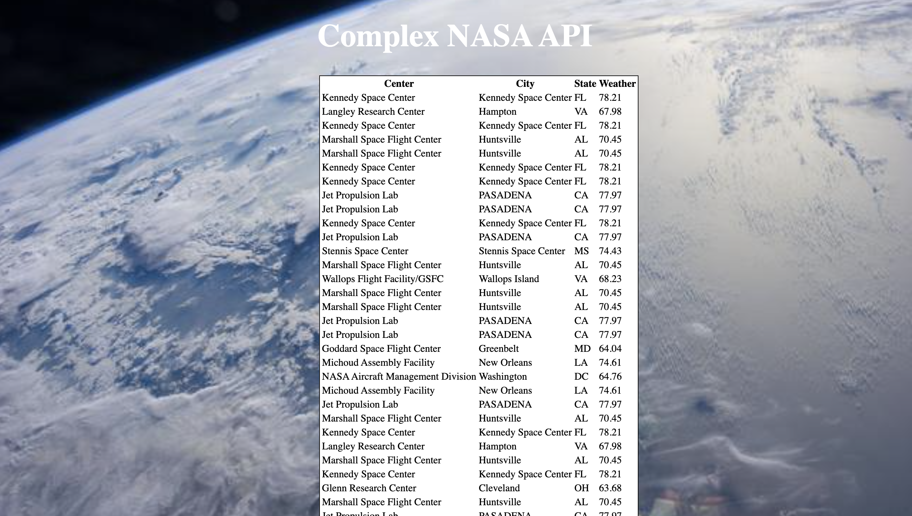

This is a NASA centered app in which returns the current temperature at each of NASA's facilities. 

Link to Project: [https://juliedodev-complexnasa.netlify.app]

How It's Made;

Tech used: 
<ul>
<li>HTML</li>
<li>CSS</li>
<li>JavaScript</li>
</ul>

Optimizations:

Lesson Learned:

I learned how to use 2 APIs in this app using nasa.gov and openweather to write a fetch statement. To get the data I had to loop through the NASA api to get the data.
