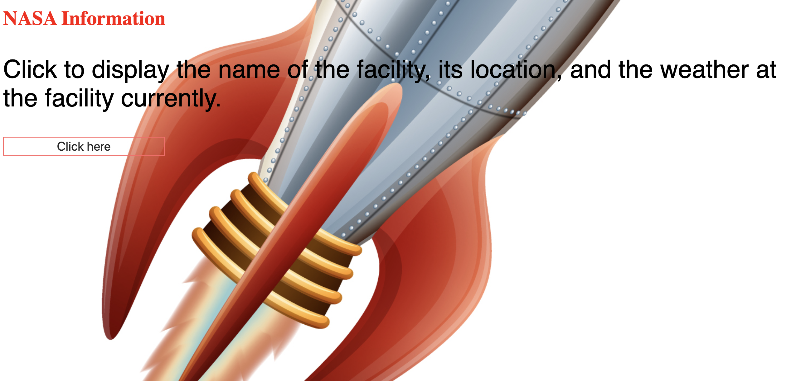

 🚀 Complex NASA API

The user is able to with just a click of a button, see the locations of NASA nationwide. Alongside the current temperature of the facility.

This was made with HTML,CSS, Javascript, NASA's API, and DarkSky's weather API.

View NASA's locations and current temperatures here: https://zen-edison-c2420b.netlify.com/

