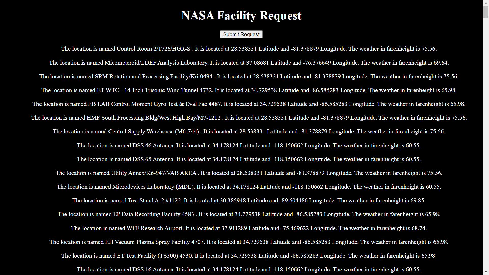

# 🚀 Project: Complex NASA API

### Goal: Use NASA's API to return all of their facility locations (~400). Display the name of the facility, its location, and the weather at the facility currently. 

<strong>Built with HTML, CSS, JavaScript</strong>

