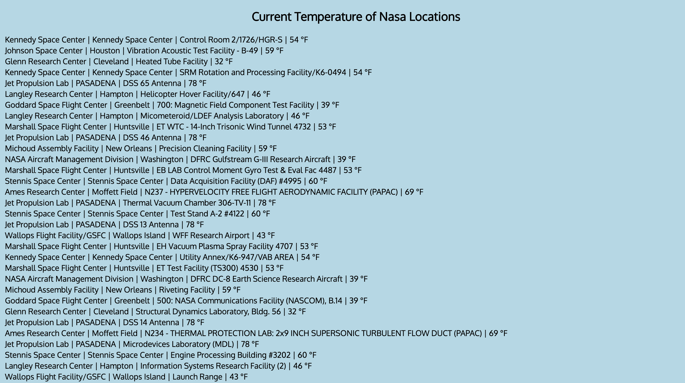

# 🚀 Project: Complex NASA API

### Goal: Use NASA's API to return all of their facility locations (~400). Display the name of the facility, its location, and the weather at the facility currently. 

## Take a look at the list here: https://serene-williams-ab1608.netlify.com/ 

## Technology Used 
- HTML 
- CSS
- Javascript