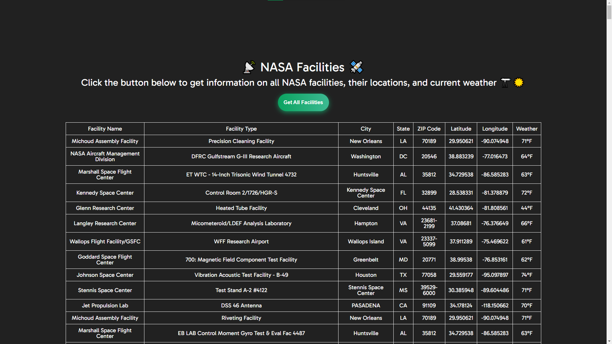

# NASA Facilities & Weather Viewer 🚀🌦️

## Project Description

The NASA Facilities & Weather Viewer aims to provide users with information about NASA's facilities, including the facility name, type, location, and current weather conditions. By utilizing NASA's API and the OpenWeatherMap API, the project dynamically generates a table displaying these details for over 400 NASA facilities.

## How It's Made 🛠️

- **Technologies Used:** HTML, CSS, Vanilla JavaScript, Fetch API
- **Project Organization:**
  - Organized project into folders: css (for styles), js (for JavaScript files), and the root folder containing README and index.html.
- **Dynamically Adding Table Rows:**
  - Leveraged Vanilla JavaScript to dynamically add table headers and rows based on the length of the JSON object retrieved from the NASA API.

## Lessons Learned 🧠

- **Fetch API and Dynamic Table Generation:**
  - Acquired skills in using the Fetch API to retrieve data dynamically.
  - Gained insights into dynamically generating table headers and rows based on the fetched JSON object.
- **Distinct Facility Values:**
  - Explored methods for identifying and handling distinct facility values.
  - Created an array to store data and eliminate duplicates.
- **Weather Data Integration:**
  - Overcame challenges in integrating weather data from the OpenWeatherMap API.
  - Calculated and displayed the current temperature in Fahrenheit after converting from Kelvin.

## Getting Started 🚀

To explore NASA's facilities and their current weather, follow these steps:

1. Clone the repository.
2. Open the `index.html` file in your preferred web browser.
3. Click the "Get NASA Facilities" button to populate the table with facility information and weather data.

Feel free to contribute, report issues, or provide feedback to enhance the NASA Facilities & Weather Viewer.