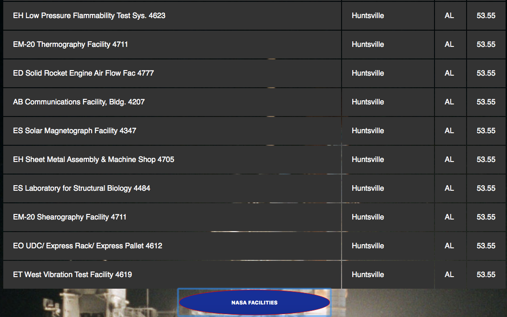

# 🚀 Project: Complex NASA API

I used NASA's API to return all of their facility locations (~400). Displayed the name of the facility, its location, and the weather at the facility currently. To make this organized I created a table and row variables in javascript and used appendchild to put the rows in the table.

TOOLS used: HTML, CSS, JAVASCRIPT

