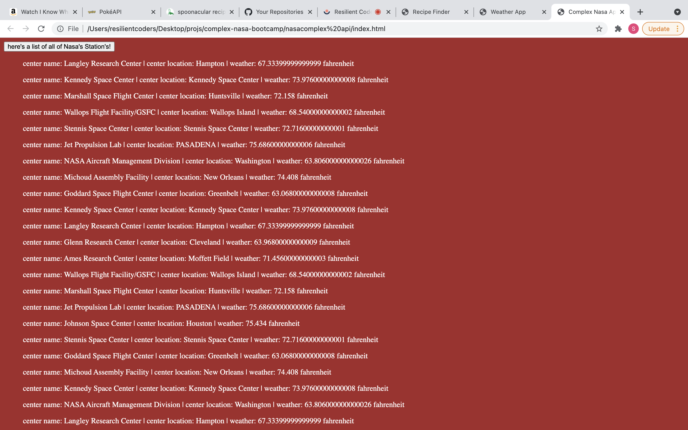

# Complex Nasa API
#### Project Scope: Use Nasa's and Open Weather Map's API to return all of their facitilies. Display the facilities' name, location and outside temperature. 
#### View project: https://svdev-complexnasa.netlify.com

# How it was made:
#### HTML5, CSS3, Javascript E6, API, JSON

# Optimizations:
#### Created a for loop that runs through every object in the Nasa API and prints them on the DOM as text nodes in LI elements. The zip code of each facility is fed into the weather API to display the current temperature. 

# Lesson Learned: 
#### How to print objects to the DOM by creating text nodes in conjunction with a separate API. 

API Source: 
Nasa: https://data.nasa.gov/Management-Operations/NASA-Facilities/gvk9-iz74
Open Weather: https://openweathermap.org/api
