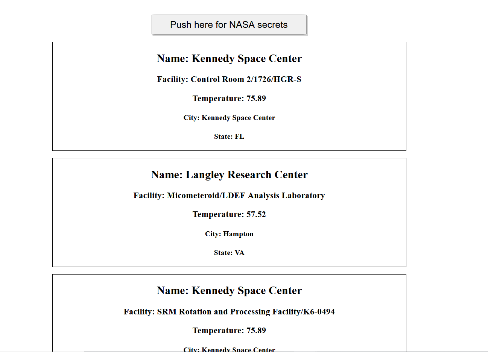

# 🚀 Project: Complex NASA API
link: https://frosty-mccarthy-53d418.netlify.com/

### Goal: Use NASA's API to return all of their facility locations (~400). Display the name of the facility, its location, and the weather at the facility currently. 

### How I did it:

- The page initially just has a button, clicking it will activate an event listener function
- The function calls the NASA facilities API and gets back an object with alltheir names and locations
- The location information is used to call a second API which contains information about the weather at that location
- After the call resolves, all the relevant information for the facilities is gathered in variables which are appended to newly created nodes
- The nodes are added to an overall div container that is also created in the js and that div is later appended to the body 
