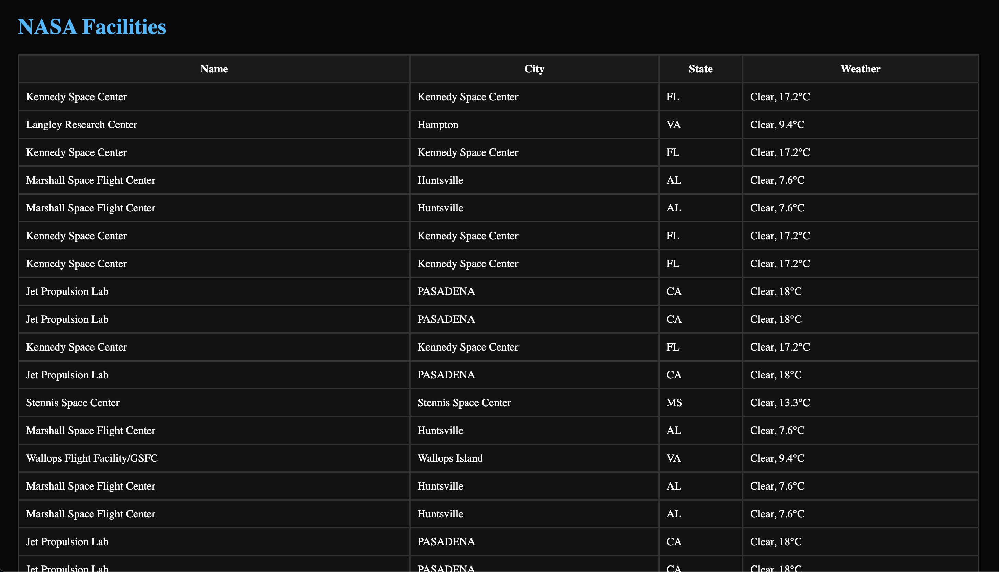

# 🚀 Project: Complex NASA API

### Goal: Use NASA's API to return all of their facility locations (~400). Display the name of the facility, its location, and the weather at the facility currently. 

Link to project: https://alejandralondev.github.io/complex-nasa-bootcamp/ 

How It's Made:
Tech used: HTML, CSS, JavaScript,

This app was challenging in finding the right parameters to chain to find the required specs of the project. It was good practice on reading documentation and being able to source the information correctly.