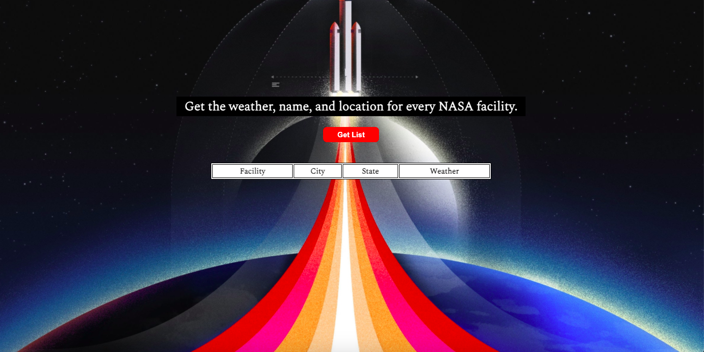

## 🚀  Goal
Use NASA's API to return all of their facility locations (~400). Display the name of the facility, its location, and the weather at the facility currently. 

## 🌦  How it's made
Made using HTML, CSS, Javascript, API and JSON. 

## 🚀  Lesson Learned
This project was really cool to figure out. You could see the two puzzle pieces of both the NASA API and the weather API and it's almost like how in the movies when the engineer has two conductors and they finally stick together.
